#  EXAMEN PRACTICO CRUD CON MODELO MVC

## ¿Que es este proyecto? 
Este es un CRUD sencillo basado en el modelo MVC(Modelo, vista y controlador) utilizando como lenguaje principal el PHP.
Este proyecto posee las 4 funciones principales de un CRUD las cuales son: Insertar, Buscar, Eliminar y Modificar.

## Configuracion del CRUD: 

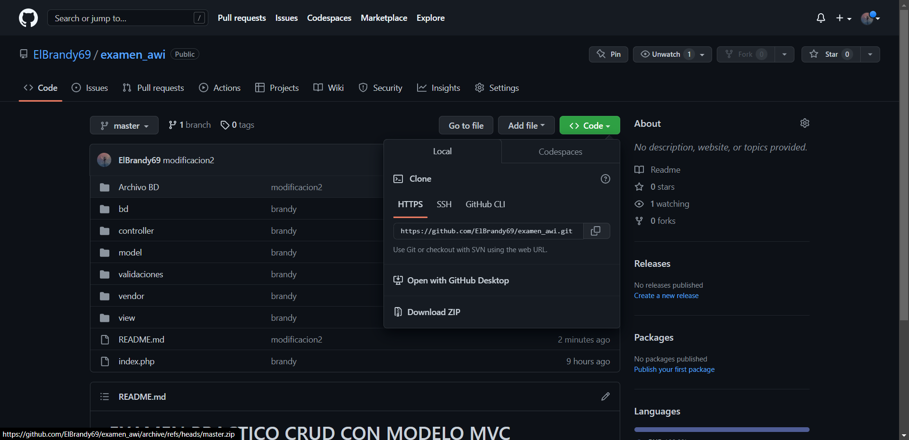

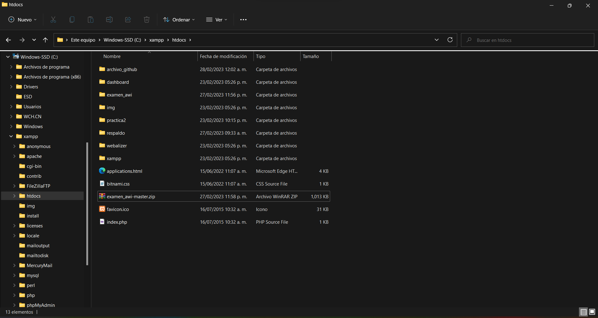

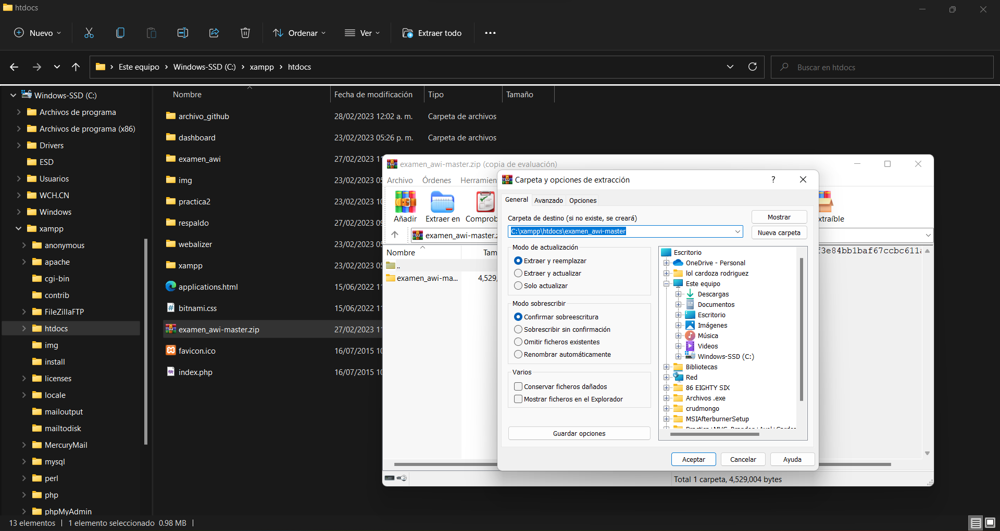

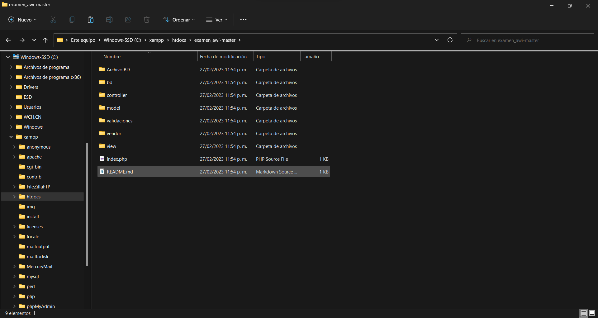

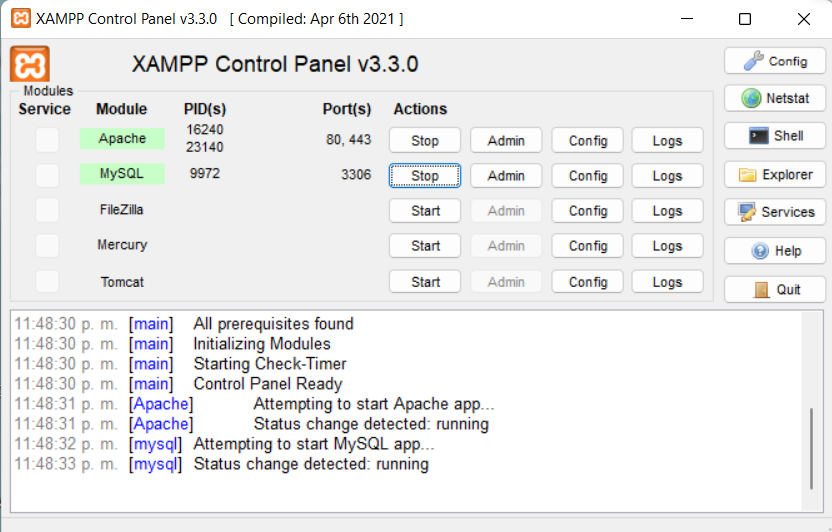

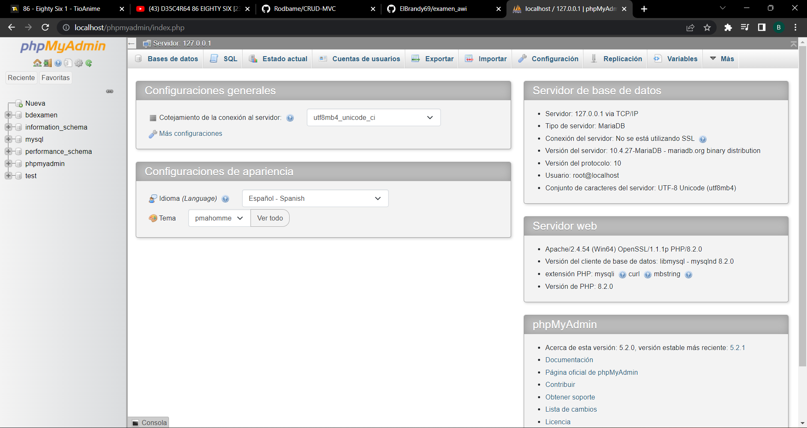

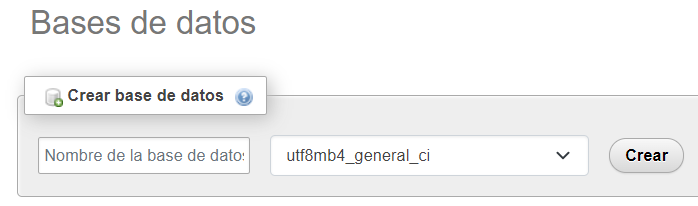

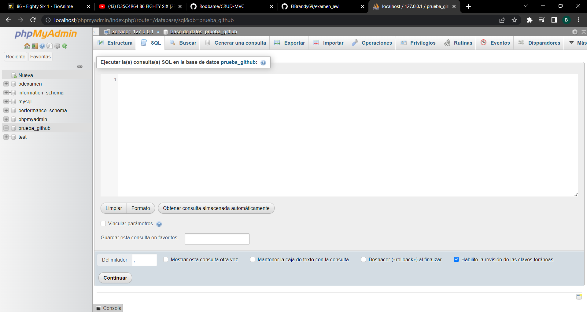

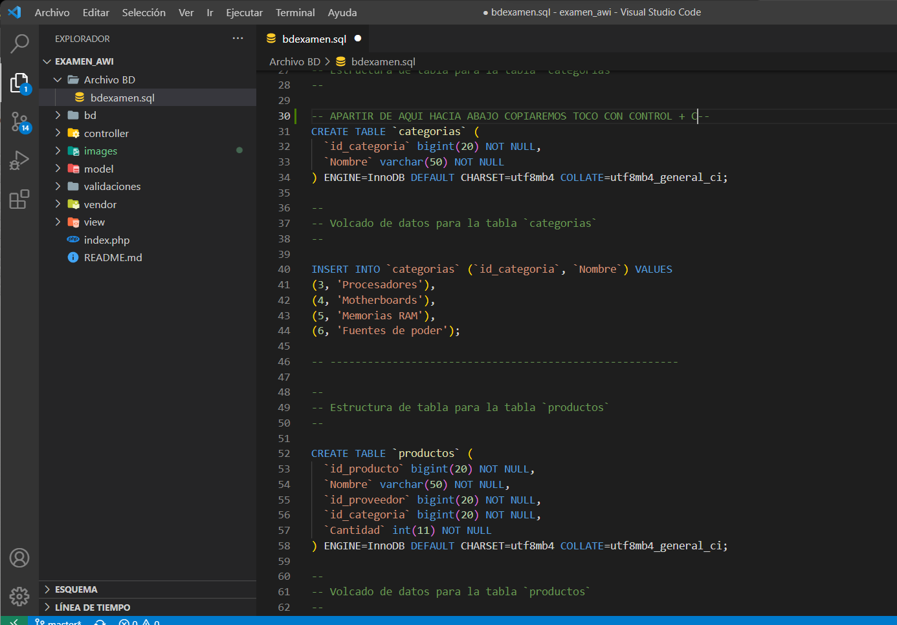

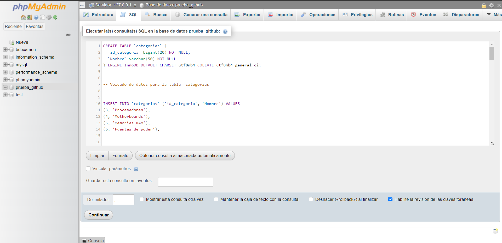

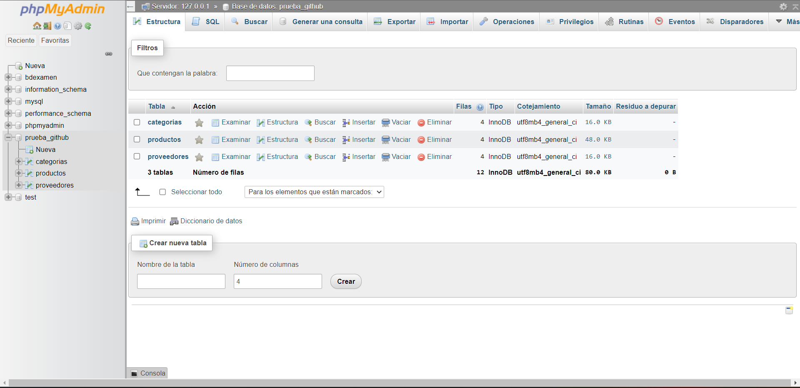

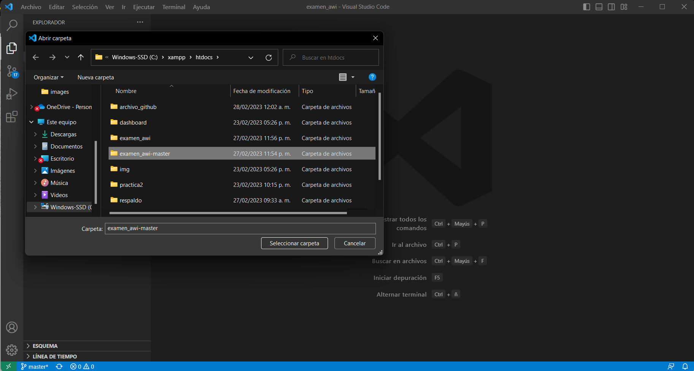

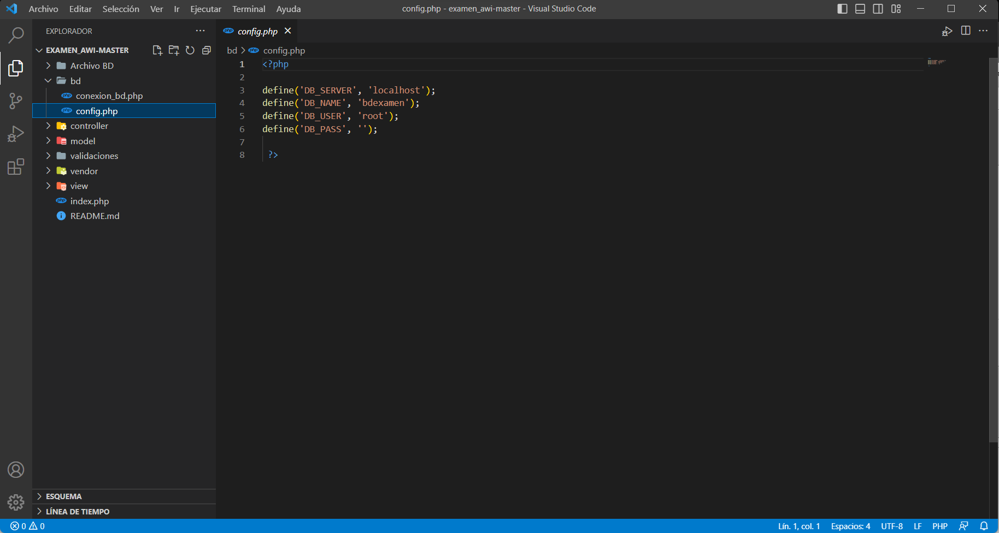

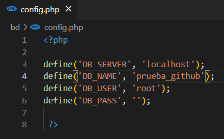

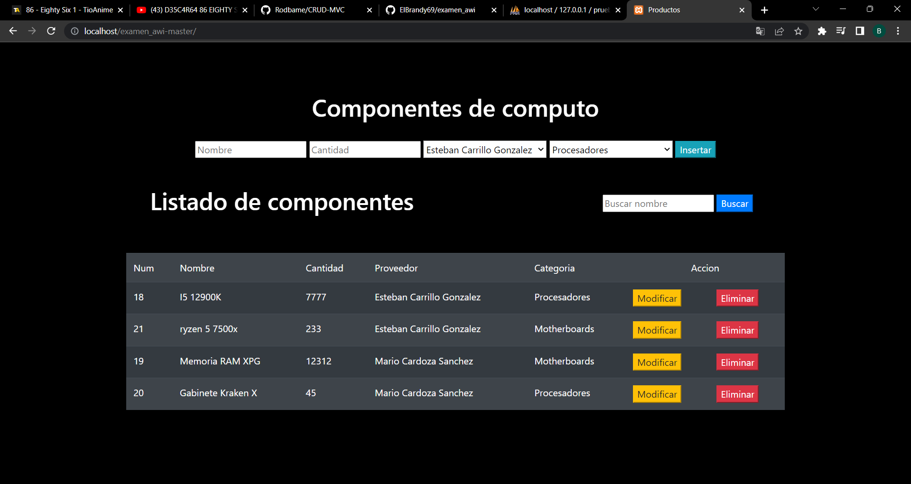

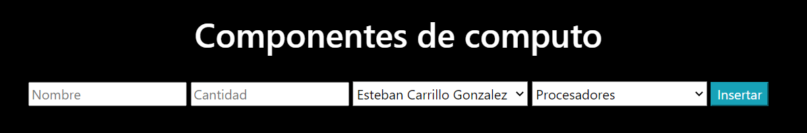

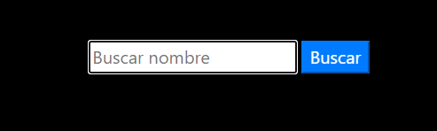

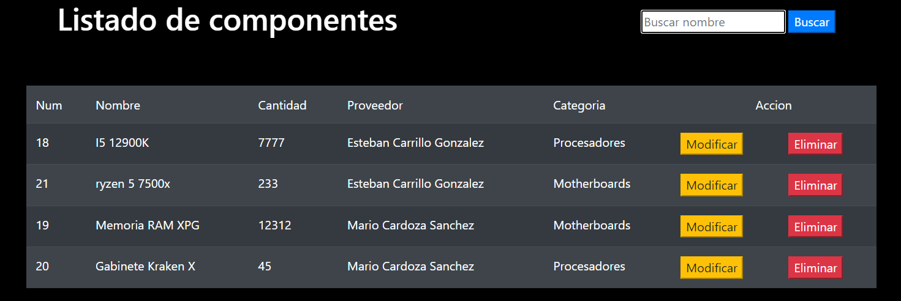

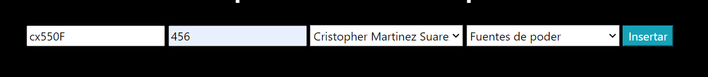

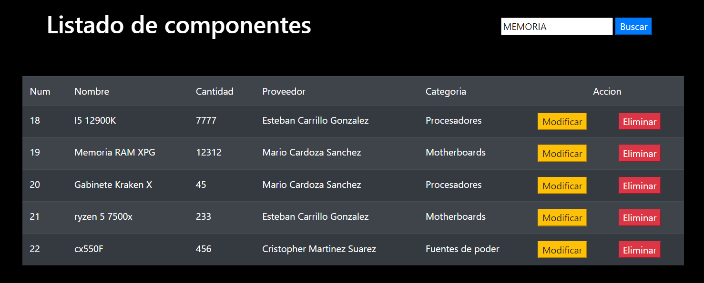

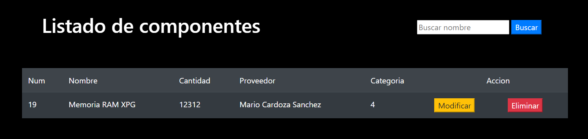

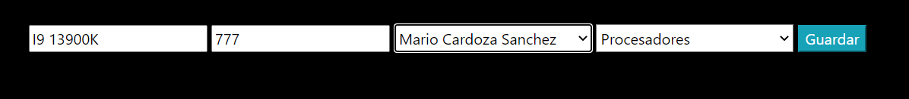

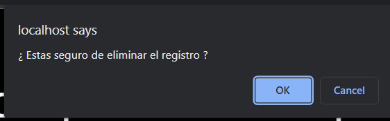

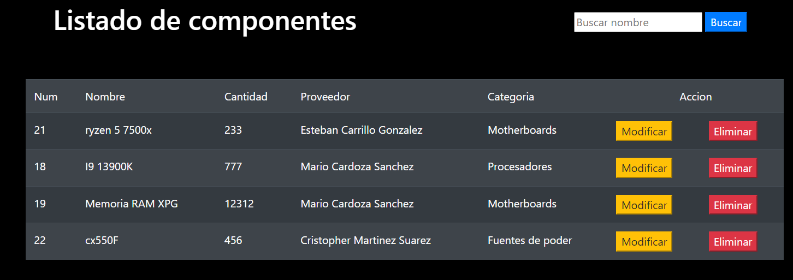

