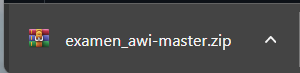
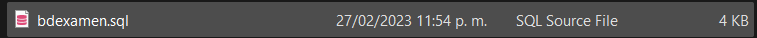
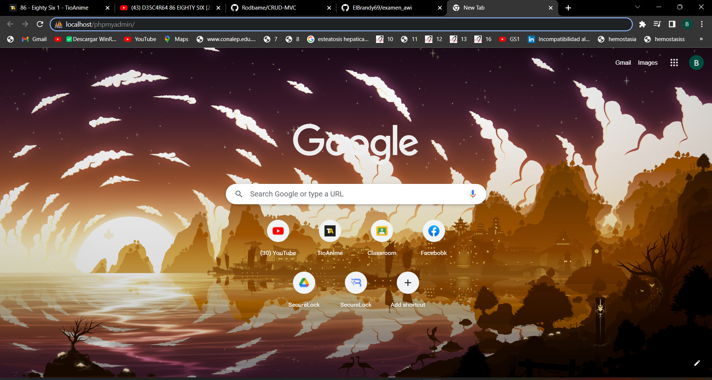
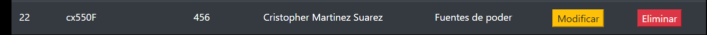
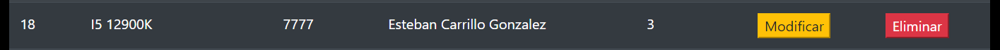
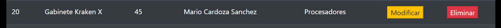

#  EXAMEN PRACTICO CRUD CON MODELO MVC

## ¿Que es este proyecto? 
Este es un CRUD sencillo basado en el modelo MVC(Modelo, vista y controlador) utilizando como lenguaje principal el PHP.
Este proyecto posee las 4 funciones principales de un CRUD las cuales son: Insertar, Buscar, Eliminar y Modificar.

## Configuracion del CRUD: 

Primero que nada deberemos de descargar el archivo de nuestro proyecto en formato zip.

Posteriormente deberemos localizarnos en nuestro disco local/xampp/htdocs y ahi es donde copiaremos el archivo descargado.

Deberemos extraer el contenido del archivo y podremos visualizar todos los archivos que este posee.

Una vez conseguido esto, nos hubicaremos en la carpeta Archivo BD, la cual es la que contiene el archivo para realizar la creacion de las tablas de la base de datos.

Al mismo tiempo, deberemos de haber inicializado nuestro XAMPP

Una vez encendido, nos diriguiremos a nuestro navegador y en este escribiremos localhost/phpmyadmin para inicializar el gestor de base de datos.

Una vez dentro tendremos que crear una base de datos a la cual podremos asignarle el nombre que nosotros deseemos.

Una vez creada abriremos una hoja de SQL.

Abriremos la carpeta que acabamos de importar con la herramienta de Visual Studio Code, y abriremos el archivo de la carpeta Archivo BD, el cual se llama "bdexamen.sql"
Copiaremos el archivo a partir de la creacion de la tabla de categorias.

Lo pegaremos en la hoja sql que abrimos anteriormente y le daremos clic en continuar.

Posteriormente ya se nos habran creado y cargado todas las tablas con sus llaves primarias y foraneas.

Una vez hecho esto nos tendremos que dirigir a nuestra carpeta de bd, la cual posee todas las configuraciones de conexion a la base de datos. Especificamente el archivo de config.php.

Se nos mostraran 4 campos que podremos modificar: host, usuario, contraseña y nombre de la base de datos.

Una vez ya cargado todo, nos ubicaremos en la URL y colocaremos la ruta de la carpeta iniciando por localhost/examen_awi-master

### Funciones

Insertar

Colocaremos este apartado los datos que vamos a controlar en los registros y daremos clic en Insertar 

Buscar

Nos ubicaremos en la barra de busqueda ubicada en el extremo superior derecho y colocaremos el nombre que deseemos buscar, posteriormente daremos clic y se nos buscara el registro automaticamente.

Modificar

Nos ubicaremos en un registro y daremos clic en el boton de modificar, se nos mostrara los datos del registro en el menu anteriormemnte usado para insertar, modificaremos los datos y daremos clic en guardar. A continuacion se vera como los datos se han modificado.

Eliminar

Seleccionaremos el registro que deseamos eliminar, confirmaremos la eliminacion del registro y posteriormente podremos ver como se ha eliminado el registro satisfactoriamente.

